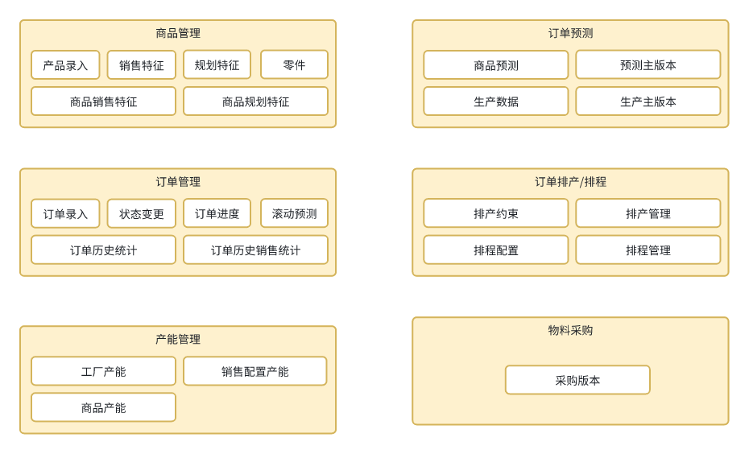

# peanut 门户组成部分

## aps 高级排产排程模块

1. 产品预测
2. 订单管理
3. 订单排产
4. 订单排程

## 模块功能如下：



# 项目说明

该模块可以单独启动， 也可以配合 peanut-portal增加多个模块一起启动。  
单APS启动为启动 tmp.APSBootstrapApplication

如需单独打包启动，增加spring-boot打包插件

```xml

<plugin>
    <artifactId>spring-boot-maven-plugin</artifactId>
    <configuration>
        <includeSystemScope>true</includeSystemScope>
    </configuration>
    <groupId>org.springframework.boot</groupId>
</plugin>

```

# 项目技术/文档
[项目文档/技术框架等](https://gitee.com/slsplatform/aps-end/blob/master/README.md)


# 变更记录  
## 1.5.2
1. 优化商品状态变更时 工艺路径节点计算